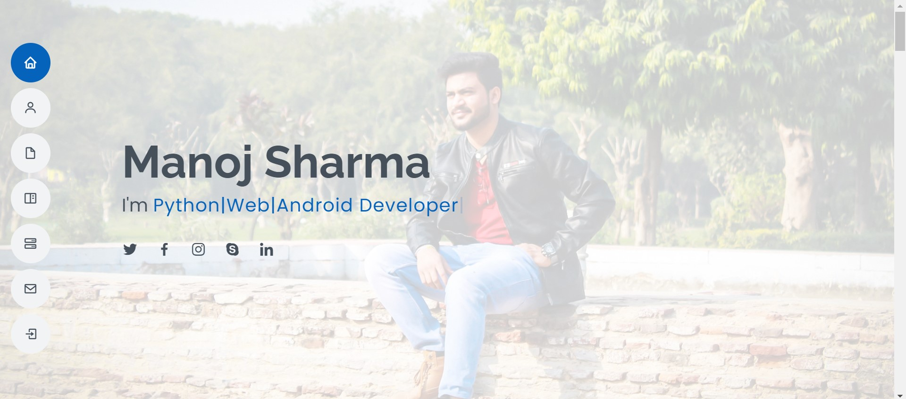
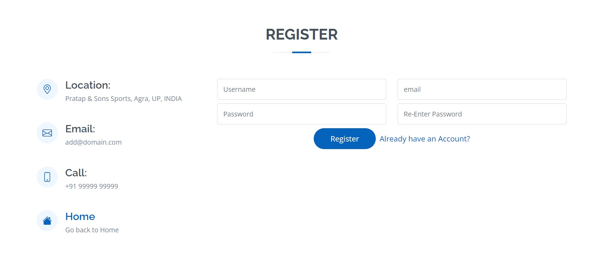
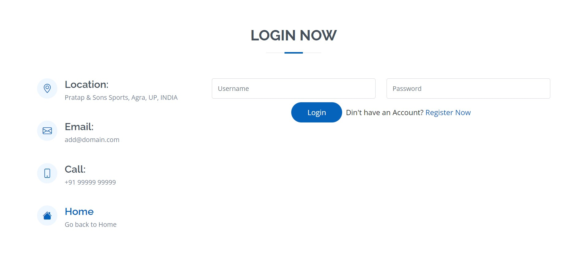
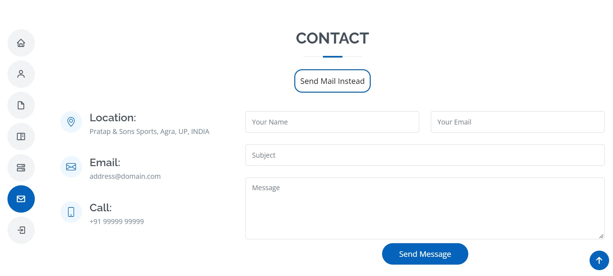
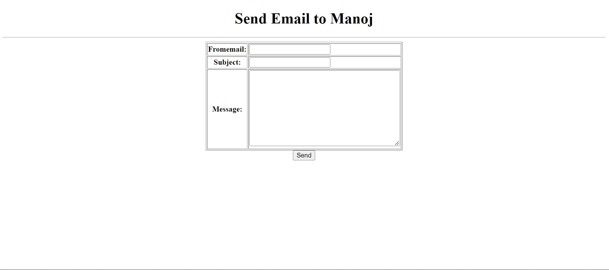

# Portfolio
Portfolio website built with python and django.
Clone this repo using link
Follow below step to run project but make sure you have python and jango installed in your pc:
1. Goto setting.py and enter you smtp credentials
2. Run Server using command: python manage.py runserver

## 📸 Features

## Built With 🛠
- [HTML](https://www.w3schools.com/html/)
- [CSS](https://www.w3schools.com/css/)
- [BOOTSTRAP](https://www.w3schools.com/bootstrap/)
- [JS](https://www.w3schools.com/js/)
- [PYTHON](https://www.python.org/)
- [DJANGO](https://www.djangoproject.com/) 
  
## Backend 🛠
  - [PYTHON](https://www.python.org/)
  - [DJANGO](https://www.djangoproject.com/)
  
## Contact
If you need any help, you can connect with me.

Visit:- [Manoj Sharma](https://devmansh.github.io) | [LinkedIn](https://linkedin.com/in/devmansh) | [Instagram](https://www.instagram.com/themohitsharma.in/)
